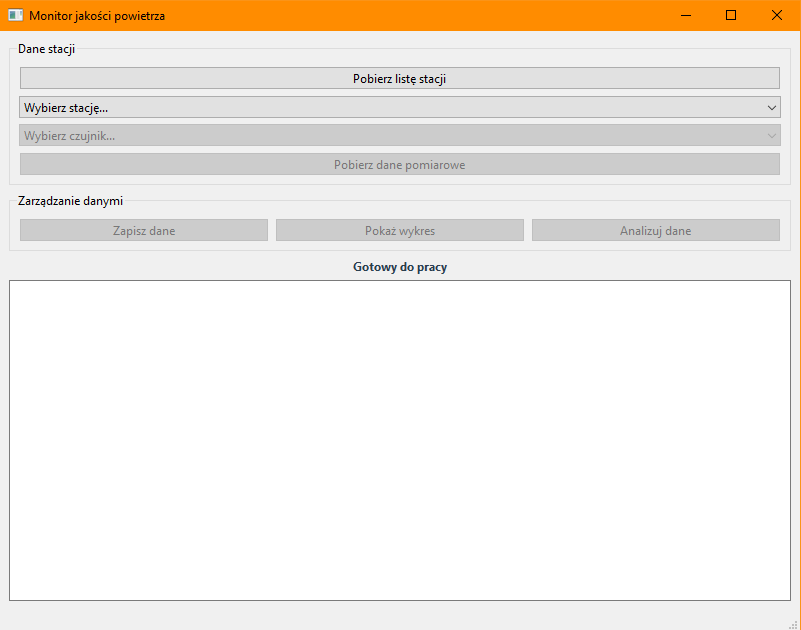

# Pogoda - Monitor Jakości Powietrza



Aplikacja do monitorowania jakości powietrza w Polsce, wykorzystująca dane z GIOŚ.

## Funkcje
- Pobieranie danych z API GIOS
- Wizualizacja na wykresach
- Zapis/odczyt danych lokalnie
- Analiza statystyczna
- Interfejs graficzny Qt

## Instalacja

### Linux/Mac
```bash
git clone https://github.com/MateuszG9/pogoda.git
cd pogoda
mkdir build && cd build
cmake -DCMAKE_PREFIX_PATH=/path/to/qt ..
make
```

### Windows
```cmd
git clone https://github.com/MateuszG9/pogoda.git
cd pogoda
mkdir build && cd build
cmake -G "Visual Studio 16 2019" -A x64 ..
cmake --build . --config Release
```

## Użycie
1. Kliknij "Pobierz listę stacji",
2. Wybierz stację z listy,
3. Wybierz czujnik,
4. Kliknij "Pobierz dane",
5. Analizuj dane, generuj wykresy lub zapisz je w bazie danych.

## Dokumentacja
```bash
doxygen Doxyfile
# Otwórz html/index.html
```

## Wymagania systemowe
Zobacz [requirements.txt](requirements.txt)

## Licencja
[MIT License](LICENSE)

## Autor
Mateusz Gnutek
155670
mateusz.gnutek@student.put.poznan.pl